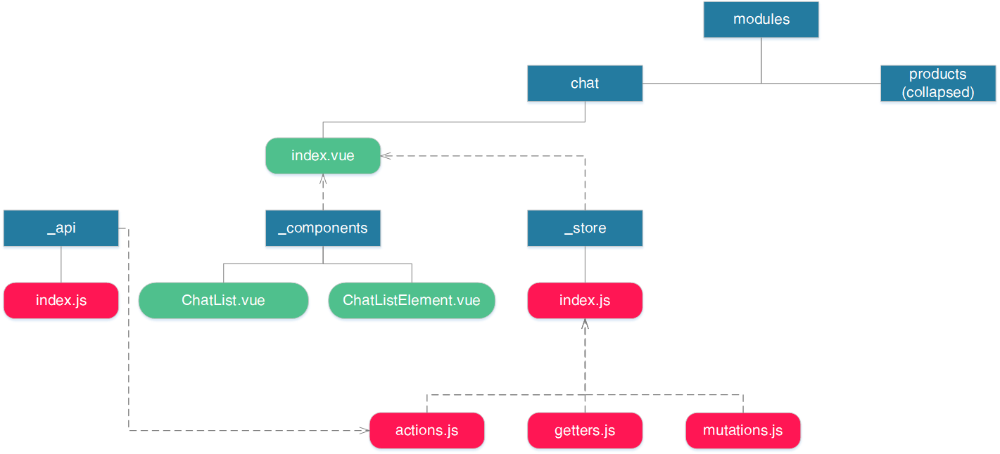
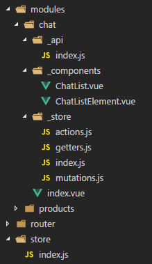

# vue-architecture-awesome by <a href="https://github.com/kumochan/vue-architecture-awesome">kumochan</a>

> A Vue.js/Vuex project showcasing a complex but scalable store structure.

## Showcase/Architecture

A feature scoped, but still namespaced store structure. `index.vue` is the
container of the module.

<p><details>
  <summary><b>diagram</b></summary>
  <p></p>
</details></p>

<p><details>
  <summary><b>file structure</b></summary>
  
</details></p>

## Dependencies

<p><details>
  <summary><b>npm dependencies</b></summary>

| Dependency | Version |
| ---------- | ------- |
| vue        | ^2.5.13 |
| vue-router | ^3.0.1  |
| vuex       | ^3.0.1  |

</details></p>

## Installation

The installation process is split into two sections for
[development](#development) and [production](#production) use. You can find a
production version of this site live at
[netlify.com]

### Development

<p><details>
  <summary><b>instructions</b></summary>

#### Using npm

```shell
npm install
npm run dev
```

#### Using yarn

```shell
yarn install
yarn run dev
```

</details></p>

### Production

<p><details>
  <summary><b>instructions</b></summary>

#### Using npm

```shell
npm install
npm run build
```

#### Using yarn

```shell
yarn install
yarn run build
```

</details></p>

## Examples

* [kumochan/vue-architecture-awesome](https://github.com/kumochan/vue-architecture-awesome)

## Contact

<a href="thaotrinh.info"></a>

## Contributors

<table><thead><tr><th align="center"><a href="https://github.com/kumochan"><br><sub>kumochan</sub></a><br><p>Contributions: 28</p></th></tbody></table>

## License

_vue-architecture-awesome_ is realeased under the
[MIT License](/License.md).
